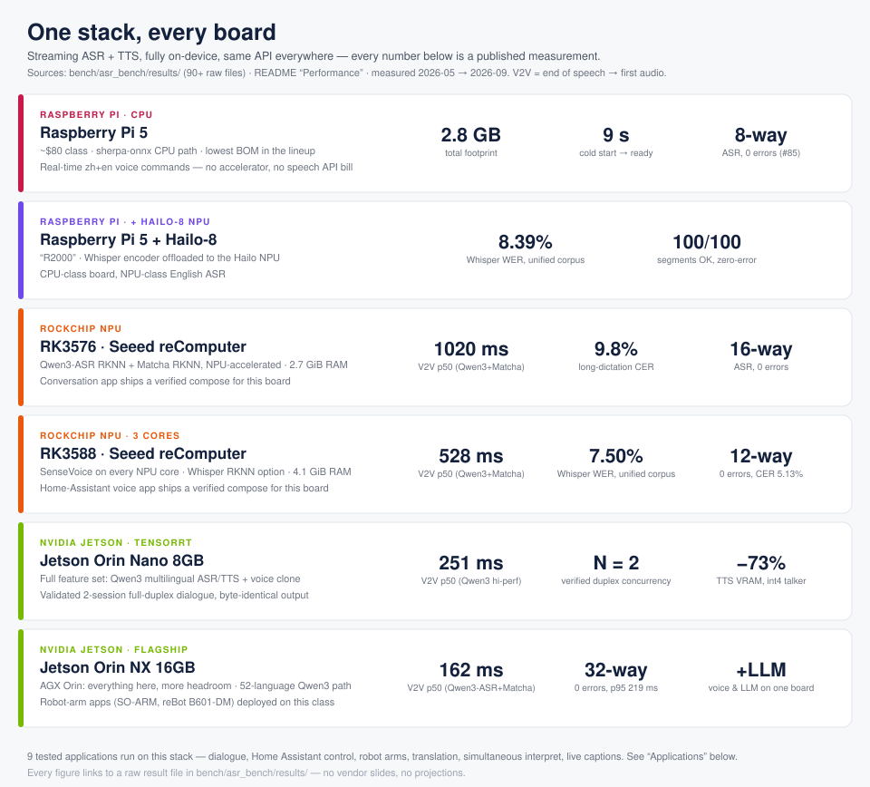

# OpenVoiceStream

> **English** | [中文](README.zh-CN.md)

**Native-engine streaming ASR + TTS for edge dialogue.** One container, stable HTTP/WebSocket APIs, and validated paths across Jetson, Rockchip, and Raspberry Pi ecosystems.

<p align="center">
  <a href="https://github.com/suharvest/openvoicestream"></a>
  <a href="#architecture"></a>
  <a href="#tts-model-comparison"></a>
  <a href="#architecture"></a>
  <a href="https://www.docker.com/"></a>
  <a href="#supported-devices"></a>
  <a href="LICENSE"></a>
</p>

<p align="center">
  
</p>

**OpenVoiceStream is the deployable voice product** — the FastAPI/WebSocket server, device profiles, install/deploy machinery, and the agent gallery (voice-controlled robot arm, live captioning, simultaneous interpretation, translation). It runs fully on-device, avoids heavyweight ML frameworks in the hot path, and keeps the client API stable while you switch between sherpa-onnx, TensorRT-EdgeLLM, RKNN, and CPU ONNX backends.

**What each board can do — every number below is a published measurement,**
traceable to [`bench/asr_bench/results/`](bench/asr_bench/results/) (90+ raw
files) and [BENCHMARKS.md](BENCHMARKS.md):



**The speech engine underneath is [`voxedge`](https://github.com/suharvest/voxedge)** — a standalone, pip-installable (`pip install voxedge`), pure-Python/numpy library that does the real-time ASR + TTS + conversation loop. This repo *consumes* voxedge (as a wheel) and adds everything needed to ship it as a product. Want to embed edge voice in your own app? Use voxedge directly. Want a turnkey on-device voice server with prebuilt images and agents? You're in the right place.

## Why This Matters

OpenVoiceStream is meant to make local voice practical at product scale: start
with low-cost real-time voice I/O, then move up to human-like speech or a fully
local voice + LLM loop without changing the client API.

<p align="center">
  
</p>

Board prices vary by region and kit contents. The point is the order of
magnitude: simple Raspberry Pi-class boards can handle real-time voice input and
output, while Jetson-class edge AI boards can run expressive speech and local LLM
dialogue without a per-call speech API bill.

## Quick Start

Clone once on the target device; the installer validates the host, selects the
right compose file, pulls the image, starts the service, and can run health,
capability, TTS smoke, and TTS-to-ASR round-trip checks:

```bash
git clone --recurse-submodules https://github.com/suharvest/openvoicestream.git
cd openvoicestream

deploy/install.sh --pull --verify   # auto-detects Jetson, Rockchip, or Raspberry Pi
```

Choose the target explicitly when auto-detect is not enough:

```bash
deploy/install.sh --target orin-nx --pull --verify  # v0.9.1: Qwen3-ASR + Matcha + local LLM
deploy/install.sh --target jetson --pull --verify
deploy/install.sh --target rk3588 --pull --verify
deploy/install.sh --target rk3576 --pull --verify
deploy/install.sh --target rpi --pull --verify
```

### Recommended models — by use case and language

**Dialogue** (full-duplex ASR + TTS). The TTS pick follows the language —
Matcha is our best-measured Chinese voice, English and other languages have
their own best picks:

| Use case | ASR | TTS | Start from |
|---|---|---|---|
| **Chinese dialogue** | Qwen3-ASR | **Matcha** — best measured zh TTS (RTF 0.05 on RK3588) | Orin NX `jetson-edgellm-v091-matcha` · RK `rk3588-default` / `rk3576-default` · RPi `rpi` |
| **English dialogue** | Qwen3-ASR | **Kokoro** — 53 English voices | Jetson `jetson-paraformer-kokoro` · RK `rk3588-kokoro-rknn` |
| **Multilingual / minor languages** | **Qwen3-ASR** (52 langs) | Jetson: **Qwen3-TTS** (52 langs, voice clone) or MOSS-TTS-Nano · RK: **Piper** (de/fr/ja…) or Kokoro (ja) | Jetson `jetson-multilang-*` / `jetson-moss-tts-nano-trt` |

**Transcription** (accuracy first, no TTS). Two engines, different language
lanes:

| Use case | Model | Measured |
|---|---|---|
| **Chinese / multilingual transcription** | **SenseVoice** (50+ langs, NPU) | CER 5.13% at 12-way zero-error on RK3588 |
| **English long-form transcription** | **Whisper** | WER 7.50–8.51% on one fixed corpus across five devices |

Every pairing keeps the same client API — switching models is a restart,
not a rewrite.

After startup, the service listens on `http://device:8621`:

| Target | URL | Compose file | Image |
|---|---|---|---|
| Orin NX v0.9.1 | Speech `:8621`, LLM `:8000` | `deploy/docker-compose.edgellm-v091-{voice,cutover}.yml` | model-neutral speech + LLM runtimes; engines downloaded per model |
| Jetson | `http://device:8621` | `deploy/docker-compose.yml` | `sensecraft-missionpack.seeed.cn/solution/seeed-local-voice:jetson-v1.14-hotswap` |
| RK3576 | `http://device:8621` | `deploy/docker-compose.rk.yml` | `sensecraft-missionpack.seeed.cn/solution/seeed-local-voice:rk-qwen3asr-opt-20260610` |
| RK3588 | `http://device:8621` | `deploy/docker-compose.radxa.yml` | `sensecraft-missionpack.seeed.cn/solution/seeed-local-voice:rk-qwen3asr-opt-20260610` |
| Raspberry Pi | `http://device:8621` | `deploy/docker-compose.rpi.yml` | `sensecraft-missionpack.seeed.cn/solution/seeed-local-voice:rpi-v1.0-onnx` |

The published Docker images currently keep the previous registry namespace so
existing deployments can pull the same artifacts during the rename.

The qualified Orin NX v0.9.1 path, rollback procedure, and the SHA-locked
GDN/MTP payload revisions are documented in
[`docs/deploy/jetson-orin-nx-v091.md`](docs/deploy/jetson-orin-nx-v091.md).
For a step-by-step build-up on a fresh device — host prerequisites, topology
choice, profile selection, and troubleshooting — see
[`docs/runbooks/jetson-voice-stack-setup.md`](docs/runbooks/jetson-voice-stack-setup.md).
New to the repo? [`docs/REPRODUCE.md`](docs/REPRODUCE.md) is the end-to-end,
from-zero reproduction guide (run a prebuilt image, rebuild the engines, or
build the images).

Manual verification:

```bash
# Same default URL on Jetson, RK3576, RK3588, and Raspberry Pi.
deploy/verify.sh --url http://device:8621 --tts-smoke --roundtrip
curl http://device:8621/health
```

OpenAI-compatible clients can discover the active ASR/TTS model IDs and their
runtime capabilities before sending audio:

```bash
curl http://device:8621/v1/models
curl http://device:8621/v1/capabilities

# Use an active TTS model id returned by /v1/models.
curl -X POST http://device:8621/v1/audio/speech \
  -H "Content-Type: application/json" \
  -d '{"model":"<tts-model-id>","input":"Hello from the edge."}' \
  --output speech.wav

# Use an active ASR model id returned by /v1/models.
curl -X POST http://device:8621/v1/audio/transcriptions \
  -F "model=<asr-model-id>" -F "file=@speech.wav"
```

`POST /v1/audio/speech` uses HTTP chunked streaming on the same route when the
active backend supports streaming. Select `voice` and `speed` only from the
model-specific declarations returned by `GET /v1/capabilities`.

Client examples live in [`examples/`](examples/):

```bash
python3 examples/stream_tts_to_wav.py \
  --url http://device:8621 \
  --text "你好，欢迎使用 OpenVoiceStream。" \
  --out /tmp/ovs-tts.wav
```

**Deploy with compose** when you want to manage profiles yourself. The
recommended pairings above are the first profile on each platform; the rest are
switch-in options:

```bash
# Jetson — recommended: Qwen3-ASR + Matcha (v0.9.1 Orin NX path uses its own compose above).
docker compose -f deploy/docker-compose.yml up -d

# Jetson — fastest to reproduce, lightweight (the install.sh default):
OVS_PROFILE=jetson-zh-en docker compose -f deploy/docker-compose.yml up -d

# Jetson — Qwen3 multilingual ASR/TTS with voice clone.
OVS_PROFILE=jetson-multilang-highperf-nx \
docker compose -f deploy/docker-compose.yml up -d

# Jetson — TTS upgrades: Kokoro TRT (EN, 53 speakers), Paraformer+Kokoro mix,
# or MOSS-TTS-Nano (multilingual, 48kHz stereo).
OVS_PROFILE=jetson-kokoro-trt docker compose -f deploy/docker-compose.yml up -d
OVS_PROFILE=jetson-paraformer-kokoro docker compose -f deploy/docker-compose.yml up -d
OVS_PROFILE=jetson-moss-tts-nano-trt docker compose -f deploy/docker-compose.yml up -d

# Rockchip — recommended defaults (Qwen3-ASR RKNN W8A8 + Matcha RKNN).
docker compose -f deploy/docker-compose.radxa.yml up -d   # RK3588
docker compose -f deploy/docker-compose.rk.yml up -d       # RK3576

# Rockchip — Whisper ASR (EN long-form) on RK3588.
OVS_PROFILE=rk3588-whisper-10s \
docker compose -f deploy/docker-compose.radxa.yml up -d

# Rockchip — Qwen3 ASR + Kokoro RKNN TTS (multilingual, NPU-accelerated).
OVS_PROFILE=rk3588-kokoro-rknn \
docker compose -f deploy/docker-compose.radxa.yml up -d
```

`deploy/install.sh --pull --verify` auto-detects Jetson/RK/RPi on the target
device. Every profile above keeps the same client API — switching is a
restart, not a rewrite.

## Demo Gallery

Browser-based demo portal served from the device itself: live device status, one
card per capability (live captions, TTS playground, voice chat with barge-in,
voice clone, speaker diarization), runtime ASR/TTS model hot-switching, and a
kiosk mode for trade shows (`DEMO_KIOSK=1`).

```bash
docker compose -f demos/docker-compose.demos.yml --profile all up -d
# open http://<device>:8700
```

See [`demos/README.md`](demos/README.md) for deployment and server
prerequisites, and [`docs/DEMOS.md`](docs/DEMOS.md) for the full index of demo
assets (gallery cards, API examples, agent examples, bench showpieces).

## Applications

Nine application layers ship with the repo — each is a working voice product
built on the shared `ovs_agent` runtime and the SLV voice service, not a
snippet. Start one with `uv run ovs-agent run <name> --config <config.yaml>`
(or `docker compose` from its deployment matrix).

| App | What you get | Pipeline | Docs |
|---|---|---|---|
| [`conversation`](agent/ovs_agent/apps/conversation/README.md) | Minimal full-duplex voice dialogue — speak, get spoken answers, barge in | ASR → LLM → TTS | [README](agent/ovs_agent/apps/conversation/README.md) with deploy matrix |
| [`home_assistant`](agent/ovs_agent/apps/home_assistant/README.md) | Voice-control an existing Home Assistant: “把客厅的灯调暗一点” | ASR → HA intents | [README](agent/ovs_agent/apps/home_assistant/README.md) |
| [`companion_robot`](agent/ovs_agent/apps/companion_robot/README.md) | Voice entry point for embodied robots (Reachy Mini and similar) | ASR → LLM + robot tools → TTS | [README](agent/ovs_agent/apps/companion_robot/README.md) |
| [`voice_rebot_arm`](agent/ovs_agent/apps/voice_rebot_arm/README.md) | Voice-controlled robot arm with force-feedback gripper, IK, and camera-guided grasp | wake-word → ASR → LLM tool-calls → arm | [README](agent/ovs_agent/apps/voice_rebot_arm/README.md) |
| [`voice_arm`](agent/ovs_agent/apps/voice_arm/README.md) | Voice-controlled SO-ARM100 actuator | wake-word → ASR → LLM tools → TTS | [README](agent/ovs_agent/apps/voice_arm/README.md) |
| [`multi_mode`](agent/ovs_agent/apps/multi_mode/README.md) | The standard voice app with runtime-switchable modes (dialogue, commands, …) | ASR → LLM → TTS | [README](agent/ovs_agent/apps/multi_mode/README.md) |
| [`translator`](agent/ovs_agent/apps/translator/README.md) | Sentence-level voice translation, no LLM needed | ASR → MT → TTS | [README](agent/ovs_agent/apps/translator/README.md) |
| [`simul_interpret`](agent/ovs_agent/apps/simul_interpret/README.md) | Simultaneous speech interpretation with monotonic commitment (spoken audio is never retracted) | ASR → MT → TTS | [README](agent/ovs_agent/apps/simul_interpret/README.md) |
| [`live_caption`](agent/ovs_agent/apps/live_caption/README.md) | Real-time bilingual live captions on a dashboard | ASR → MT → broadcast | [README](agent/ovs_agent/apps/live_caption/README.md) |

The per-app contract (deploy matrix, recommended models, acceptance steps,
measured-results rules) is defined in the
[app catalog](agent/ovs_agent/apps/README.md).

## Table of Contents

- [Why This Matters](#why-this-matters)
- [Applications](#applications)
- [Quick Start](#quick-start)
- [Demo Gallery](#demo-gallery)
- [Key Features](#key-features)
- [Architecture](#architecture)
- [API Reference](#api-reference)
- [Qwen3 Multilingual Path](#qwen3-multilingual-path)
- [Performance](#performance)
- [Configuration](#configuration)
- [Models](#models)
- [Supported Devices](#supported-devices)
- [Patched sherpa-onnx](#patched-sherpa-onnx)
- [Project Structure](#project-structure)
- [Contributing](#contributing)
- [Changelog (separate file)](CHANGELOG.md)
- [Acknowledgements](#acknowledgements)

## Key Features

- **Streaming-first API** — WebSocket ASR with partial/final results and HTTP streaming TTS with sentence-level audio chunks.
- **Per-target quantization, native frameworks** — every model is quantized per device family (W8A8 / W4A16 / int4 / fp16-scaled) and runs on each accelerator's native runtime: TensorRT-EdgeLLM on Jetson, RKNN/RKLLM on Rockchip, HailoRT on Hailo-8, sherpa-onnx and ONNX Runtime on CPU paths. No generic fallback in the hot path.
- **Reusable edge voice library** — the backends ship as the standalone, pip-installable [`voxedge`](https://github.com/suharvest/voxedge) package (`pip install --pre voxedge`); this repo is the product server + deploy on top of it.
- **Stable backend contract** — clients keep the same `/asr/stream`, `/tts`, `/tts/stream`, and `/health` calls when profiles change.
- **Measured low latency** — 58 ms EOS-to-first-audio on Jetson Orin NX with Paraformer + Matcha; 157 ms with Qwen3 ASR/TTS voice clone.
- **Qualified Orin NX v0.9.1 stack** — Qwen3-ASR + Matcha-TTS run alongside Qwen3.5-4B GDN/MTP with an 8K context by default; a qualified 4K engine is optional. Model-level artifacts are revision- and SHA-locked. See the [v0.9.1 deployment guide](docs/deploy/jetson-orin-nx-v091.md).
- **Historical v0.9.0 concurrency validation** — the prior release verified 2-session ASR streaming (zh/en, no cross-talk) and N=2 Qwen3-TTS Base (int4 talker, ~4 GB RAM; or shared-engine with only +1.6 GB for the 2nd slot). See [BENCHMARKS.md](BENCHMARKS.md).
- **Multilingual options** — Chinese+English, English-only, and 52-language Qwen3 paths are exposed through the same service.
- **Container-first deploy** — prebuilt images, target-specific compose files, host checks, model downloads, and verification scripts are included.
- **LLM-ready agent layer** — `agent/` streams ASR results into an OpenAI-compatible or EdgeLLM backend, then streams LLM tokens directly back to TTS.
- **Fully local economics** — no speech API key, no per-call ASR/TTS bill, no runtime internet dependency after artifacts are cached, and no PyTorch/Transformers in the voice hot path.

## Architecture

```text
┌───────────────────────────────────────────────────────────┐
│  Edge device (Jetson Orin / RK3576 / RK3588 / RPi 4–5)    │
│                                                           │
│  FastAPI service (container :8000; host default :8621)     │
│  ├── WS /asr/stream    Streaming ASR                      │
│  │     └─ zh_en: Paraformer  │  en: Zipformer  │  multi: Qwen3-ASR  │  rk: Paraformer RKNN · Qwen3-ASR │
│  ├── POST /asr          SenseVoice (zh+en) · Whisper (en) │
│  ├── POST /tts          Batch TTS                         │
│  └── POST /tts/stream   Streaming TTS                     │
│        └─ zh_en: Matcha-TTS  │  en: Kokoro v1.0  │  multi: Qwen3-TTS │
│                                                           │
│  Inference: sherpa-onnx · TRT-EdgeLLM · RKNN              │
└───────────────────────────────────────────────────────────┘
         ▲ HTTP / WebSocket
         │
   Any client (SBC, laptop, robot, kiosk, ...)
```

Models are selected automatically based on `LANGUAGE_MODE`:

| Service | Endpoint | zh_en (default) | en | multilingual | Protocol |
|---------|----------|-----------------|-----|---------------|----------|
| **Streaming ASR** | `WS /asr/stream` | Paraformer bilingual | Zipformer English | Qwen3-ASR (52 langs) | WebSocket: int16 PCM in, JSON out |
| **Streaming TTS** | `POST /tts/stream` | Matcha-TTS + Vocos | Kokoro v1.0 | Qwen3-TTS (voice clone) | HTTP: JSON in, raw PCM stream |
| **Batch TTS** | `POST /tts` | Matcha-TTS + Vocos | Kokoro v1.0 | Qwen3-TTS (voice clone) | HTTP: JSON in, WAV out |
| Offline ASR | `POST /asr` | SenseVoice (zh+en+ja+ko+yue) | SenseVoice (same) · Whisper (en) | Qwen3-ASR (52 langs) | HTTP: WAV upload, JSON out |

**Backend capabilities differ:**

> **Whisper is the English option, and only that.** Chinese measured 35-56% CER on every board tested — Whisper base/tiny's own ceiling, not something a faster accelerator moves. Use Paraformer, SenseVoice or Qwen3-ASR for Chinese. It is also offline-only: the encoder window is fixed at build time and nothing carries across chunks, so there are no partials and text lands at finalize. Cross-device measurements: [`docs/perf/whisper-cross-device-20260827.md`](docs/perf/whisper-cross-device-20260827.md).

| Backend | Speed control | Pitch shift | Voice clone | Languages | Streaming |
|---------|--------------|-------------|-------------|-----------|-----------|
| Sherpa (zh_en/en) | ✅ | ✅ | ❌ | 2 (zh+en) | ✅ |
| Paraformer RKNN (RK) | ❌ | ❌ | ❌ | 2 (zh+en) | ✅ |
| Kokoro TRT (Jetson) | ❌ | ❌ | ❌ | 1 (en) | ✅ |
| Kokoro RKNN (RK3588) | ❌ | ❌ | ❌ | multi | ✅ |
| Qwen3 (multilingual) | ❌ | ❌ | ✅ (x-vector) | 52 | ✅ |
| Whisper (Hailo-8 / RK / Jetson) | ❌ | ❌ | ❌ | en (see note) | offline only |
| Qwen3-CustomVoice | ❌ | ❌ | ❌ (9 presets + instruct) | 52 | ✅ |
| MOSS-TTS-Nano (Jetson) | ❌ | ❌ | ❌ | multi | ✅ |
| RKNN (Rockchip) | ✅ | ✅ | ❌ | 2 (zh+en) | ✅ |

The service is model-agnostic at the API level — clients send audio/text, get audio/text back. Swap engines without changing client code. Unsupported parameters return `501` with `{"required_capability": "..."}`.

## API Reference

### OpenAI-Compatible Audio and Discovery

The compatibility surface uses the active model IDs returned by
`GET /v1/models`:

| Endpoint | Purpose |
|---|---|
| `POST /v1/audio/speech` | TTS from JSON `model` + `input`; returns WAV by default. Streaming-capable backends send chunked audio on this same route. |
| `POST /v1/audio/transcriptions` | ASR from multipart `model` + `file`; returns `{"text":"..."}` by default. |
| `GET /v1/models` | List configured ASR/TTS model IDs, aliases, and readiness metadata. |
| `GET /v1/capabilities` | Discover model-specific voices, speed control, streaming, cloning, and concurrency support. |

Do not hard-code voice names or assume that `speed` is supported across model
changes. Resolve the selected model's `voice` and `speed` support through
`GET /v1/capabilities`. Unsupported formats and options return a structured
client error rather than silently changing the request.

### Streaming ASR (WebSocket)

```
WS /asr/stream?sample_rate=16000&language=auto
```

- Client sends: raw **int16 PCM bytes** (audio chunks, e.g. 100ms each)
- Client sends: **empty bytes** `b""` to signal end of audio
- Server sends: JSON `{"text": "...", "is_final": bool, "is_stable": bool}`

```python
import asyncio, websockets

async def transcribe():
    async with websockets.connect("ws://device:8621/asr/stream?sample_rate=16000") as ws:
        for chunk in audio_chunks:  # np.int16 arrays
            await ws.send(chunk.tobytes())
            result = await ws.recv()  # partial results
        await ws.send(b"")  # signal end
        final = await ws.recv()  # {"text": "...", "is_final": true}
```

### Offline ASR (HTTP)

```bash
curl -X POST http://device:8621/asr \
  -F "file=@recording.wav" -F "language=auto"
# {"text": "transcribed text"}
```

### TTS (HTTP)

```bash
curl -X POST http://device:8621/tts \
  -H "Content-Type: application/json" \
  -d '{"text": "Hello world", "sid": 52, "speed": 1.0}' \
  --output output.wav
```

Parameters: `text` (required), `sid` (speaker ID, default 52), `speed` (rate, default 1.0)

**Note:** `speed` works only on backends that advertise speed control
(Sherpa/Matcha/RKNN). Qwen3-TTS (`multilanguage` profiles) does not currently
support reliable speed or pitch adjustment, so clients should treat those
parameters as unsupported on Qwen3.

### Speaker Management

Endpoints for listing, registering, and deleting TTS speakers. Speaker IDs are
scoped to the active TTS model.

```bash
# List all speakers for the active TTS model
curl http://device:8621/tts/speakers
# {"model_id": "kokoro-multi-lang-v1_0", "default_speaker_id": 52, "speakers": [...]}

# Register a voice-clone embedding (requires VOICE_CLONE capability)
curl -X POST http://device:8621/tts/speakers/register \
  -H "Content-Type: application/json" \
  -d '{"speaker_embedding_b64": "...", "label": "my-voice"}'

# Delete a registered speaker (preset speakers cannot be deleted)
curl -X DELETE http://device:8621/tts/speakers/42
```

Kokoro exposes 53 preset speakers (ids 0-52) with per-language voice labels
(`af_heart`, `bm_george`, `zf_xiaobei`, etc.). Qwen3-TTS exposes voice-clone
capability via `/tts/clone/embedding` plus persistent registration.

### TTS Streaming (HTTP)

Returns raw PCM: first 4 bytes = sample rate (uint32 LE), then int16 samples.

```
POST /tts/stream
Content-Type: application/json
{"text": "Hello world", "sid": 52}
```

### Health Check

```
GET /health  →  {"asr": bool, "tts": bool, "streaming_asr": bool}
```

## Qwen3 Multilingual Path

The v0.9.1 profiles (`jetson-edgellm-v091-*`) select Qwen3-ASR and one TTS
backend independently. Export, engine builds, and worker glue live in
[`suharvest/jetson-voice-engine`](https://github.com/suharvest/jetson-voice-engine),
pinned as `third_party/jetson-voice-engine/`. Generated artifacts use one HF
repository per model; exact repositories, revisions, hashes, and sizes are in
`deploy/artifacts/v091-release-lock.json`. The former aggregate
`qwen3-edgellm-jetson-artifacts` repository is legacy-only.

The Qwen3.5-4B GDN/MTP LLM uses the same model-level HF repository and the
same runtime image for both context contracts. The default compose selects 8K;
`EDGELLM_ENGINE_PROFILE=4k` selects the optional 4K engine. MTP safety slack is
`128` for both. Final payload locks are 4K
`06273e358a579590bb8344b451aa35c89983cd99401339fb1858d61af4dbd107` and 8K
`9208e46d61a4f1440ac68a312e35dde3d04b88edf0e4ee12b32210e7190d3325`.
Published immutable revisions are `9f2c2059341fd2135cc3a0ec09e05150277ea5b6`
(4K) and `adb1c78fb61513e2d7d8e7f889f6196dbefb1e5e` (8K).

**Quickest path on a fresh Orin NX:**

```bash
git clone https://github.com/suharvest/jetson-voice-engine.git
bash jetson-voice-engine/scripts/reproduce_qwen3_highperf.sh \
  --reference /path/to/24kHz_mono.wav   # optional: gates the voice-clone path
```

The orchestrator builds the runtime, downloads + SHA-256-verifies the HF artifacts, builds the slim docker image, starts the service, and runs the verifier (`scripts/verify_reproduction.sh`). Exit 0 means the slim container on port 18092 is healthy and serving the validated stack.

**Two runtime profiles** under the same API surface:

| Profile | Goal | Default behavior |
|---------|------|------------------|
| `official` | Minimal-diff EdgeLLM example. Close enough to upstream that it can be reviewed or upstreamed as a Qwen3 ASR/TTS example. | Semantic/correctness fixes only — tokenizer layout, sampling, runtime contract, stream callback. Regular exported Talker/CodePredictor/Code2Wav directories. |
| `highperf` (default) | Product low-latency dual-resident path for Orin. | Full vocab, ASR FP8 embedding, FP16 CustomVoice Talker on Orin NX with 1024-token Talker KV cap, CP BF16 I/O + `lm_head` pretranspose, stateful Code2Wav, CP decode CUDA graph, `ACTIVE_CP_GROUPS=13`. |

Use `jetson-multilang-highperf-nx` on Orin NX when consuming the NX-native engine set; the default `jetson-multilang-highperf` profile targets the Nano artifact set. Profiles in [`configs/profiles`](configs/profiles) set env defaults only; explicit env vars still override them.

**CustomVoice variant.** Setting `QWEN3_TTS_VARIANT=customvoice` (or an `OVS_TTS_MODEL_ID` containing `customvoice`) selects the Qwen3-TTS-12Hz-0.6B-CustomVoice talker. It ships **9 built-in speakers** (vivian, ryan, aiden, serena, dylan, eric, uncle_fu, ono_anna, sohee) driven by natural-language instructions instead of x-vector voice cloning — so the `VOICE_CLONE` capability is off and `/speakers/register` is rejected. Current CustomVoice production precision is FP16 on Orin NX; the default NX engine uses a 1024-token Talker KV cap to reduce resident memory. W8A16 is rejected until a no-preload EOS-valid quant exists.

For detailed branch ownership, engine env vars, frozen-baseline numbers, and
artifact handling, see the Jetson engine repository's
[`qwen3-current-frozen-baseline-2026-05-10.md`](https://github.com/suharvest/jetson-voice-engine/blob/main/docs/plans/qwen3-current-frozen-baseline-2026-05-10.md).

Current release status, image digests, artifact repositories, and known gaps are
tracked in [`docs/productization-status.md`](docs/productization-status.md).

## Performance

### One corpus, five accelerators — Whisper WER (2026-09)

Every device scored against the same fixed 100-item corpus per language with
the same scorer; 100/100 segments OK on all five. The only variable between
rows is the device/backend.

| Device | Whisper backend | Aggregate WER |
|---|---|---:|
| Jetson Orin NX 16GB (J4012) | TensorRT bf16 encoder + CPU ONNX decoder | **7.62%** |
| Jetson Orin Nano 8GB (J3011) | TensorRT bf16 encoder + CPU ONNX decoder | **7.62%** |
| RK3588 (reComputer) | RKNN base10 encoder + CPU ONNX decoder | **7.50%** |
| RK3576 (reComputer) | RKNN base10 encoder + CPU ONNX decoder | **8.51%** |
| Raspberry Pi 5 + Hailo-8 (R2000) | Hailo base encoder + CPU ONNX decoder | **8.39%** |

Full method, per-run notes, and the withdrawn pre-fix numbers:
[`bench/asr_bench/results/accuracy-unified-corpus.md`](bench/asr_bench/results/accuracy-unified-corpus.md).
Per-device concurrency ceilings (up to 16-way streaming ASR admission on
Jetson) are in the same directory.

### Cross-Device Benchmarks (measured 2026-05-18)

Jetson/RPi rows are from the original local forced-EOS gate against
`http://127.0.0.1:8621`. RK rows were rerun after the true-streaming fix with
`QWEN3_ASR_CHUNK_CONFIRM=0`, `--eos vad`, and `--vad-silence-ms 800`; their V2V
column is split `/asr/stream` plus `/tts/stream`.

| Target / profile | Image | TTS backend | ASR backend | TTS RTF p50 | ASR fRTF p50 | ASR CER p50 | V2V EOS→audio p50 |
|---|---|---|---|---:|---:|---:|---:|
| Orin Nano `jetson-multilang-highperf` | `jetson-v1.12-highperf` | `trt_edgellm` | `trt_edgellm` | 0.470 | 0.076 | 5.3% | 251 ms |
| Orin NX `jetson-multilang-highperf-nx` | `jetson-v1.12-highperf` | `trt_edgellm` | `trt_edgellm` | 0.417 | 0.042 | 5.3% | 157 ms |
| Orin Nano `jetson-qwen3asr-matcha` | `jetson-v1.12-highperf` | `matcha_trt` | `trt_edgellm` | 0.024 | 0.075 | 5.3% | 286 ms |
| Orin NX `jetson-qwen3asr-matcha-nx` | `jetson-v1.12-highperf` | `matcha_trt` | `trt_edgellm` | 0.018 | 0.042 | 5.3% | 162 ms |
| Orin Nano `jetson-zh-en` | `jetson-v1.12-highperf` | `matcha_trt` | `paraformer_trt` | 0.023 | 0.077 | 13.3% | 327 ms |
| Orin NX `jetson-zh-en` | `jetson-v1.12-highperf` | `matcha_trt` | `paraformer_trt` | 0.018 | 0.015 | 10.5% | 58 ms |
| RK3588 `rk3588-default` | `rk-qwen3asr-opt-20260610` | `rk:matcha_rknn` | `rk:qwen3_asr_rk` | 0.124 | 0.318 | 10.1% long avg | 528 ms |
| RK3576 `rk3576-default` | `rk-qwen3asr-opt-20260610` | `rk:matcha_rknn` | `rk:qwen3_asr_rk` | 0.290 | 0.265 | 9.8% long avg | 1020 ms |
| Raspberry Pi 5 `rpi5-default` | `rpi-v1.0-onnx` | `sherpa` | `sherpa_asr` | 0.078 | 0.000 | 20.0% | 3 ms |
| RK3588 `rk3588-whisper-10s` (2026-08-28) | `openvoicestream:rk-20260803b` | — (ASR-only) | `rk.whisper` | — | 0.092 | 10.5% en / 38.6% zh | n/a — 1013 ms EOS→text |

**The Whisper row needs three qualifications**, all of which change how it reads:

- **Its CER cell is split by language; every other row's is one number.** Whisper
  is the English option here — 10.5% WER on English long-form — and its 38.6%
  Chinese CER is Whisper base's own ceiling, not something this stack introduces.
  Every other ASR in the table is bilingual, so a single figure suits them.
- **Its last column is not V2V.** The profile is ASR-only, so there is no
  audio-out leg to measure. 1013 ms is EOS to *text*, which is the honest
  comparison for a backend that emits nothing until finalize: the Orin NX
  Paraformer row does the entire voice-to-voice loop in 58 ms.
- **The window is a product setting.** 10 s is the conversational pick; the same
  board at 20 s reaches 7.58% English long-form with roughly triple the TTFT.

The full cross-device matrix — five accelerators, both languages, one corpus and
one scorer — is in
[`docs/perf/whisper-cross-device-20260827.md`](docs/perf/whisper-cross-device-20260827.md).

The RK rows use the 2026-06-10 high-performance Qwen3 ASR W8A8 + Matcha
recheck. Forced client-EOS V2V p50 is 528 ms on RK3588 and 1020 ms on RK3576;
long-dictation average error is 10.1% / 9.8%. The real `/v2v/stream` path still
depends on the configured VAD endpointing delay.

Deployment footprint from the same run:

| Target | Image size | Model / engine volume | Resident memory | Startup to ready |
|---|---:|---:|---:|---:|
| Orin Nano | 2.02 GB | 5.14 GB | 2.14 GiB | 14 s |
| Orin NX | 2.02 GB | 5.45 GB | 1.02 GiB | 13 s |
| RK3588 | 767 MB | 3.31 GB ASR + 301 MB TTS | 4.09 GiB | 9 s |
| RK3576 | 767 MB | 2.21 GB ASR + 351 MB TTS | 2.71 GiB | 15 s |
| Raspberry Pi 5 | 568 MB | 2.19 GB | n/a from Docker stats | 9 s |

Concurrency smoke (`parallel=2`, `asr_tts_simul`) passed on Jetson Nano/NX
Paraformer+Matcha, RK3588, RK3576, and Raspberry Pi 5. Jetson p=2 is
functional but TTS becomes throughput-bound (RTF ~1.3-1.4), so use Orin NX or a
Qwen3 ASR + Matcha split when low-latency concurrent dialogue matters. Full raw
JSON paths and methodology are in the
[`performance test runbook`](docs/perf-test-runbook.md).

### Concurrency history (v0.8.0 / v0.9.0, 2026-06/07)

- **v0.8.0** — validated 2-session concurrency on Jetson: ASR N=2 streaming
  (zh+en, no cross-talk, 3rd session rejected with `4389 too_many_sessions`),
  TTS N=2 via slot-pool (int4 talker, 245.9 MB vs 903 MB fp16) or shared-engine
  (2nd slot adds only +1.6 GB); concurrent output byte-identical to solo,
  zero CUDA errors.
- **v0.9.0** — six-model on-device verification on Orin NX (SparkTTS-0.5B
  W4A16 became the all-round pick), N=2 re-verified on the new stack.

Full gate IDs, per-model tables, and the zero-regression analysis are in
[BENCHMARKS.md](BENCHMARKS.md).

### TTS Model Comparison

The current release uses Matcha/Vocos for the bilingual path, Kokoro for
English-only deployments, Qwen3-TTS when voice cloning or 52-language TTS is
required, MOSS-TTS-Nano for a lightweight multilingual TTS-only path, and
SparkTTS for attribute-controllable timbres plus zero-shot voice clone. The RTF
numbers below are from the 2026-05-18 benchmark run where available; the unused
research models are kept as historical context.

| Model | Current role | Streaming RTF p50 | First audio p50 | Notes |
|-------|--------------|------------------:|----------------:|-------|
| **Matcha-TTS + Vocos** | Default bilingual TTS | 0.018 on Orin NX, 0.075 on RK3588, 0.078 on RPi5 | 2.6-7.5 ms | Fastest practical TTS path; no voice clone. |
| **Qwen3-TTS** | Multilingual voice clone | 0.417 on Orin NX, 0.470 on Orin Nano | 4.4-7.3 ms | Higher quality/features, much heavier than Matcha. x-vector clone, or `customvoice` variant (9 instruction-controlled presets). |
| **SparkTTS** | Controllable + voice clone (Jetson) | **0.50 (v0.9.0 W4A16)**, 0.74 on v0.8.0 | **0.41–0.46 s (v0.9.0 W4A16)**, ~0.25 s clone / ~0.9 s controllable on v0.8.0 | Qwen2.5-0.5B + BiCodec single-codebook. **50 controllable timbres** (gender × 5 pitch × 5 speed, no reference audio) **and** zero-shot voice clone (cos ~0.90). On **v0.9.0 W4A16 is the all-round pick** — faster and lighter with zero quality loss; bf16 also ships. W4A16 INT4-AWQ engine 645 MB (−58%), bf16/fp16 mixed-precision (Qwen2.5 fp16-overflow fix). ZH CER 0 / EN WER ≤0.02; N=2 byte-identical. |
| **MOSS-TTS-Nano** | Multilingual TTS-only (Jetson) | — | ~157 ms TTFA on Orin NX | 0.1B model, 48kHz stereo via C++ TRT (19× faster than ORT CPU fallback). No voice clone. |
| **Kokoro v1.0** | English-only TTS | Not in this benchmark run | Historical ~130 ms TTFT | Kept for English-only deployments. On RK3588 a hybrid CPU+NPU RKNN path serves multilingual TTS (`rk3588-kokoro-rknn`). |
| CosyVoice3 | Research only | Not shipped | Historical ~800 ms TTFT | Higher quality, too heavy for this release. |
| F5-TTS | Research only | Not shipped | Historical ~2.5 s TTFT | Not suitable for low-latency edge dialogue. |

Current streaming benchmark scripts live in `bench/perf/`.

### Performance Tuning

Run once after boot on Jetson to lock clocks to max:

```bash
sudo ./scripts/setup-performance.sh
```

This sets MAXN power mode, locks CPU/GPU clocks, and disables dynamic frequency scaling. Critical for consistent inference latency.

## Configuration

### Environment Variables

| Variable | Default | Description |
|----------|---------|-------------|
| `OVS_PROFILE` | unset | Preferred OpenVoiceStream profile selector, e.g. `jetson-zh-en`, `jetson-multilang-highperf-nx`, `rk3588-default`, `rpi5-default` |
| `LANGUAGE_MODE` | `zh_en` | `zh_en` (Chinese+English), `en` (English only), or `multilanguage` (Qwen3, 52 langs; profiles usually set this for you) |
| `TTS_PROVIDER` | `cuda` | ONNX execution provider |
| `TTS_DEFAULT_SID` | `52` | Default TTS speaker ID (52=af_cute, 3=af_heart) — Sherpa only |
| `TTS_DEFAULT_SPEED` | `1.0` | TTS playback speed for backends that support it; Qwen3-TTS does not |
| `TTS_NUM_THREADS` | `4` | TTS inference threads |
| `TTS_PITCH_SHIFT` | `0` | Pitch shift in semitones — **Sherpa only** |
| `SENSEVOICE_LANGUAGE` | `auto` | SenseVoice language hint |
| `STREAMING_ASR_PROVIDER` | `cuda` | Streaming ASR execution provider |
| `MODEL_DIR` | `/opt/models` | Model storage directory |

Copy `.env.example` to `.env` to customize.

### Jetson Kokoro TensorRT Profile

`OVS_PROFILE=jetson-kokoro-trt` enables the validated Kokoro split-generator
runtime on Jetson Orin (TTS-only, English, 53 preset voices). Three sibling
profiles share the same artifact set — `jetson-kokoro-trt-quality` (48
tokens, conservative long-text gate), `jetson-kokoro-trt-long` (96 tokens,
more 256-512 bucket coverage), and `jetson-paraformer-kokoro` (bilingual
Paraformer ASR + Kokoro TTS).

Engine layout, bucket routing, and the streaming token splitter are engine-level
details: see the frozen artifact record
[`deploy/artifacts/kokoro_trt_manifest.json`](deploy/artifacts/kokoro_trt_manifest.json)
and the reproduction guide
[`docs/kokoro-trt-reproduction.md`](docs/kokoro-trt-reproduction.md).
Use `scripts/verify_tts_asr_roundtrip.py` when Kokoro TTS and the local ASR
service are exposed on separate ports.

## Models

Nine model families ship behind the same API — ASR: Qwen3-ASR, SenseVoice,
Paraformer, Whisper · TTS: Matcha, Kokoro, Qwen3-TTS, MOSS-TTS-Nano, SparkTTS.
You never pick artifacts by hand: each device family automatically pulls its
own quantized, framework-native build at first start.

**Why the measured numbers are what they are:** every model is quantized
per target (W8A8 / W4A16 / int4 / fp16-scaled) and runs on each
accelerator's native inference framework — TensorRT on Jetson, RKNN/RKLLM
on Rockchip, HailoRT on Hailo-8, sherpa-onnx/ONNX Runtime on CPU. No generic
fallback sits in the hot path. That is how an $80 Raspberry Pi reaches
real-time, and an RK3588 holds 12-way zero-error concurrency.

Model artifacts are downloaded and cached in a Docker volume on first start;
measured volume footprints are 5.14-5.45 GB on Jetson, 2.56-3.61 GB on RK,
and 2.19 GB on Raspberry Pi 5. Artifact revisions are locked per profile —
see [Configuration](#configuration) and [BENCHMARKS.md](BENCHMARKS.md).

## Supported Devices

The stack is chip-family based and open — any board in the same family
should work. These are the boards we measure on (all Seeed Studio kits):

| Device family | Validated on | Notes |
|---|---|---|
| **Jetson Orin Nano / NX** | Orin Nano 8GB, Orin NX 16GB | CUDA 12.6 / JetPack 6.2. Full feature set including Qwen3 multilingual + voice clone. |
| **RK3588** | Seeed reComputer (RK3588) | RKNN runtime. Qwen3-ASR works; release TTS uses the validated hybrid Matcha path. |
| **RK3576** | Seeed reComputer (RK3576) | RKNN runtime, same backend set as RK3588 at a lower power budget. |
| **RK1828** (PCIe NPU coprocessor) | via [`rkvoice-stream`](third_party/rkvoice-stream) | Qwen3-TTS and Gemma-4 AudioLLM offload on the RK1828 card. |
| **Raspberry Pi 5 / 4** | Raspberry Pi 5 8GB, Pi 4 4GB | CPU inference. Lowest BOM (~$80). Real-time zh+en commands. |

Requirements: Docker plus enough disk for the image and model volume. Current
measured footprints are about 7.5 GB total for Jetson, 3.2-4.4 GB for RK, and
2.8 GB for Raspberry Pi 5. Runtime memory depends on the profile: about 1.0-2.1
GiB on Jetson, 2.7-4.1 GiB on RK, and CPU-only on Raspberry Pi. On Jetson,
NVIDIA Container Runtime is required; on Rockchip, the host NPU driver
(`rknpu`) must be loaded.

## Patched sherpa-onnx

OpenVoiceStream ships a patched sherpa-onnx that fixes Paraformer streaming tail truncation (the stock version drops the last 1–3 characters). The patch:

1. **IsReady()** — forces decode of remaining frames after `InputFinished()`
2. **DecodeStream()** — zero-pads partial final chunks
3. **CIF force-fire** — emits residual tokens at end-of-stream

Pre-built `.so` files live in `patches/sherpa-onnx-lib/` (aarch64, Python 3.10, CUDA 12.6). See `patches/README.md` for rebuild instructions.

## Project Structure

> **New here?** Read [ARCHITECTURE.md](ARCHITECTURE.md) first — it maps the three
> repos (this product + `voxedge` library + `voxedge-engine`), the two processes,
> and how to run the whole thing locally with no GPU. [DEVELOP.md](DEVELOP.md) is
> the dev-box checklist; [docs/CONFIGURATION.md](docs/CONFIGURATION.md) covers
> profiles and env vars.

For the business layer used by SenseCraft solutions, see the
[Agent application catalog](agent/ovs_agent/apps/README.md). It defines the
per-app contract for deployment instructions, recommended models, functional
acceptance, and device-specific measurements. The
[`conversation` app README](agent/ovs_agent/apps/conversation/README.md)
documents the app used by `conversational_voice_ai`, including its compose
matrix and the boundary between configured recommendations and measured
end-to-end results.

```text
openvoicestream/
├── server/                  # FastAPI voice service (the product server)
│   ├── main.py              # Endpoints and startup
│   ├── core/                # VAD, ASR/TTS contracts, streaming, HF artifact download
│   └── utils/               # numpy mel + helpers
├── agent/                   # the voice agent — a SEPARATE package + container
│   └── ovs_agent/           # framework + app business layers
│       └── apps/            # per-app docs and implementations
├── voices/                  # Custom voice embeddings (auto-patched into model)
├── bench/                   # Streaming + V2V latency benchmarks (perf harness)
├── patches/                 # Paraformer EOF truncation fix
├── scripts/                 # Engine build, model download, diagnostics
│   └── kokoro_experiments/  # Archived Kokoro graph-surgery investigations
├── examples/                # API usage examples (TTS streaming, V2V client)
├── tests/                   # Integration and E2E tests
├── deploy/
│   ├── docker-compose.yml   # Production deploy (pre-built image)
│   ├── artifacts/           # Deployment manifests
│   └── docker/
│       ├── Dockerfile.jetson  # Jetson Orin Nano/NX/AGX (zh_en or multilingual)
│       ├── Dockerfile.rk      # Rockchip RK3576/RK3588 NPU
│       └── Dockerfile.rpi     # Raspberry Pi 4/5 (CPU)
├── configs/                 # Device profiles (Jetson, RK, RPi)
├── third_party/             # Submodules (independently maintained)
│   ├── jetson-voice-engine  # Qwen3 export + engine build for Jetson
│   └── rkvoice-stream       # Rockchip NPU streaming voice runtime
└── docs/                    # Guides, runbooks, comparison reports
```

The **per-engine ASR/TTS backends live in the sibling [`voxedge`](https://github.com/suharvest/voxedge) library** (`pip install --pre voxedge`), not in this repo. The product's backend registry (`server/core/asr_backend.py` / `tts_backend.py`) points at `voxedge.backends.*`; install `voxedge[rk]` on Rockchip for the NPU runtime.

Clone with `--recurse-submodules` to pull `third_party/*`, or run `git submodule update --init --recursive` after cloning.

### Unified backend structure (self-serve reproduce & publish)

Every backend — Jetson (TensorRT-Edge-LLM), Rockchip (RKNN), and Raspberry Pi
(sherpa-onnx) — follows the **same layout**, so any one of them can be
reproduced, rebuilt, and published without insider knowledge:

| Per-backend asset | Purpose |
|---|---|
| `recipes/` | the engine/model build + export steps (pin the upstream commit, run the export API) |
| `HF_ARTIFACTS` | the published Hugging Face bundles end users pull (e.g. `harvestsu/qwen3-tts-0.6b-base-jetson-trtllm-int4fp8`) |
| `docs/` (runbook) | deploy + verify steps for that backend (e.g. [docs/deploy-v080-n1n2.md](docs/deploy-v080-n1n2.md)) |
| `AGENTS` | the agent/dispatch guardrails for working on that backend |

Jetson, RK, and RPi are **first-class peers** — none is the "main" backend, and
the same `recipes → HF_ARTIFACTS → docs → AGENTS` contract holds for each, so
anyone can self-serve a reproduction or a release.

> **DIVERGENCE — fork vs self-authored runtime.** The one structural difference
> is the *source* of the runtime: the Jetson backend's runtime extensions live
> in our **fork of TensorRT-Edge-LLM** (upstream-bug fixes + local runtime
> extensions land in the fork; `jetson-voice-engine` only carries overlay /
> recipes and regenerates patches from it). The RK and RPi runtimes are
> **self-authored** (`rkvoice-stream`, patched sherpa-onnx). This is a deliberate
> ownership boundary, not an inconsistency — every backend still exposes the same
> recipes/artifacts/docs/agents surface above.

## Changelog

Release history and past milestones live in [CHANGELOG.md](CHANGELOG.md).
Measured results, old and new, live in [BENCHMARKS.md](BENCHMARKS.md) and
[`bench/asr_bench/results/`](bench/asr_bench/results/).

## Contributing

Issues and PRs are welcome. The most useful contributions:

- New backend integrations (other NPUs, other inference engines)
- Streaming benchmarks on additional hardware
- Bug reports with reproducible audio samples and `LANGUAGE_MODE` / profile info
- Documentation improvements, especially deployment recipes for new devices

If you're working on a larger change, open an issue first to align on the approach. Sub-project changes (Qwen3 export, Rockchip runtime) belong in their own repos: [`jetson-voice-engine`](https://github.com/suharvest/jetson-voice-engine), [`rkvoice-stream`](https://github.com/suharvest/rkvoice-stream).

## Acknowledgements

- [sherpa-onnx](https://github.com/k2-fsa/sherpa-onnx) — speech inference engine powering the bilingual ASR and TTS paths
- [next-gen Kaldi](https://github.com/k2-fsa) — research foundation behind sherpa-onnx
- [Paraformer](https://github.com/modelscope/FunASR) — streaming bilingual ASR model
- [Matcha-TTS](https://github.com/shivammehta25/Matcha-TTS) — fast flow-matching TTS (zh+en mode)
- [Kokoro](https://huggingface.co/hexgrad/Kokoro-82M) — high-quality English TTS with 53 speakers (en mode)
- [Zipformer](https://github.com/k2-fsa/icefall) — efficient transducer ASR (en mode)
- [SenseVoice](https://github.com/FunAudioLLM/SenseVoice) — multilingual offline ASR
- [Qwen3](https://huggingface.co/Qwen) — multilingual ASR + TTS foundation model (52-language path)
- [TensorRT-EdgeLLM](https://github.com/NVIDIA/TensorRT-LLM) — Jetson inference runtime for the Qwen3 path
- [RKNN Toolkit](https://github.com/rockchip-linux/rknn-toolkit2) — Rockchip NPU runtime for the RK3576/RK3588 path
